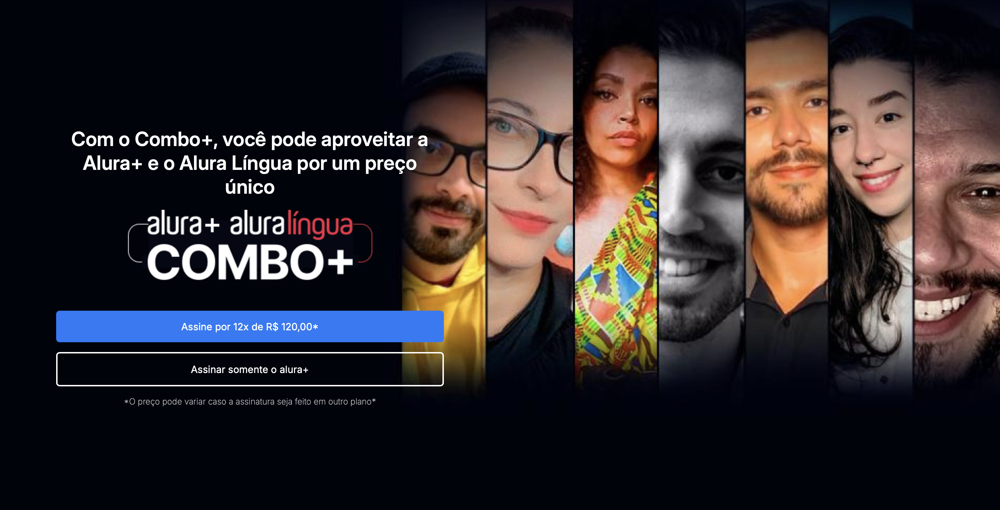

# Alura Plus - Assinatura de Cursos de Tecnologia e Idiomas

## Badges

## Índice
- [Sobre o Projeto](#sobre-o-projeto)
- [Status do Projeto](#status-do-projeto)
- [Funcionalidades](#funcionalidades)
- [Tecnologias Utilizadas](#tecnologias-utilizadas)
- [Autor](#autor)

## Sobre o Projeto
O **Alura Plus** é uma plataforma de assinatura que combina a Alura+ e o Alura Língua, oferecendo acesso a cursos em diversas áreas da tecnologia e aprendizado de idiomas. Com o Combo+, os usuários podem aproveitar ambos os serviços com um preço especial, utilizando o site em qualquer dispositivo.

## Status do Projeto
**Em desenvolvimento.** Esta versão inclui o layout responsivo para dispositivos móveis, além de efeitos de transição.

## Funcionalidades
- Layout responsivo e adaptável a dispositivos móveis
- Assinatura integrada de Alura+ e Alura Língua
- Interface intuitiva com links de navegação rápidos

## Tecnologias Utilizadas

	•	HTML5 e CSS3 para estrutura e design
	•	Visual Studio Code para o desenvolvimento
	•	SVGs para ícones de redes sociais
	•	Fonts: Inter e Roboto

 ## Autor
 • Rodrigo Souza - Desenvolvedor web em formação
